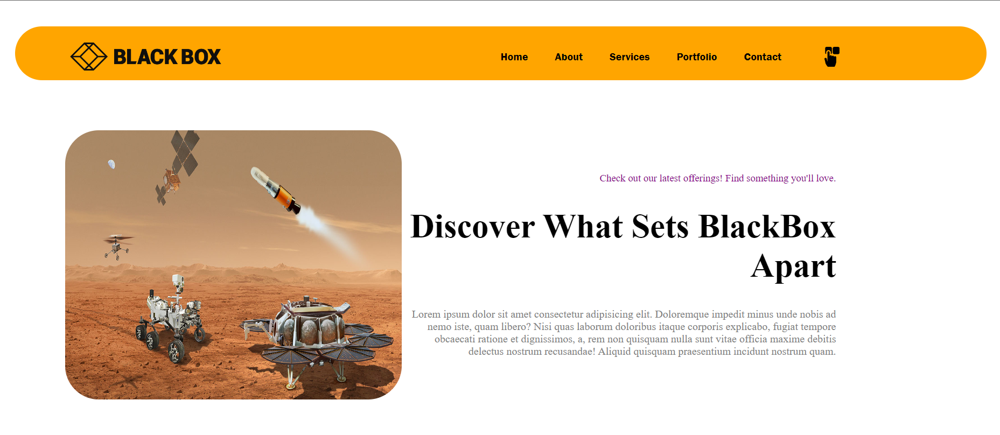
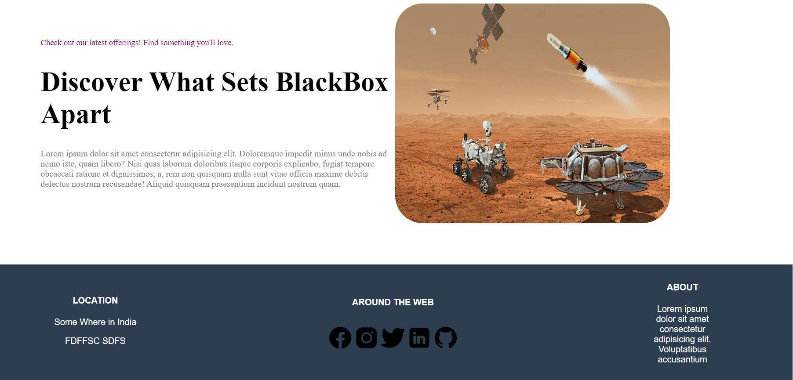

# Assignment 01
# Overview

Welcome to the Assignment 01 branch! This branch contains the code for the first assignment. This Assignment includes implementation of a Landing Page, Sign up and Sign in Page using HTML and CSS3.

# Tasks
## Task 01 : Landing Page
### Description
I've successfully crafted a responsive landing page using HTML and CSS3, featuring an navbar with interactive links, a flex-based hero section, and an footer with social media links. Additionally, I've incorporated media queries to make the page responsive.

### Screenshots

## Task 02 : Sign up / Sign in Page
### Description
I've made a comprehensively styled Sign in and Sign Up page using HTML and CSS3,featuring  an aesthetically pleasing design with captivating CSS keyframe animations. Additionally, I've incorporated media queries to make the page responsive.

### Screenshots

